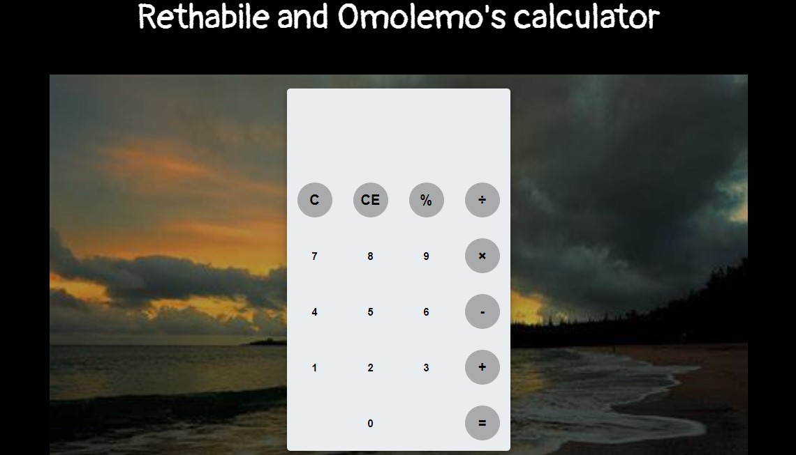

<h1> Rethabile and Omolemo's calculator</h1>

A simple calculator using HTML, CSS and Javacript

This calculator performs basic mathematical calculations such as;
<ol>
    <li>Addition</li>
    <li>Subtraction</li>
    <li>Multiplication and</li>
    <li>Division</li>

</ol>

 Not only does this calculator provide mathematical functions , it also provides the user with calculation history and memory capabilities.

And this simple calculator functionality was achieved using javascript.

<h1>Steps to execute this calcuator</h1>

<ul>
    <li>Open up the index.html</li>
</ul>

<h1>Technologies used</h1>

<ul>
    <li>HTML</li>
    <li>CSS</li>
    <li>JavaScript</li>
</ul>

<h1>Credits</h1>

This project was a collab and the following people worked together to build it; 
1. Omolemo Lethuloe -https://github.com/OmolemoBlessingLethuloe 
 
2. Rethabile Mphahlele -https://github.com/Retha05M 
 
 
And a tutorial was followed on YouTube to build it, and here is the link to the tutorial; 

Code Spot -https://www.youtube.com/watch?v=CI2GwL--ll8&t=312s

<h1>Clone the code using this link:</h1>

git clone -https://github.com/OmolemoBlessingLethuloe/Calculator.git

